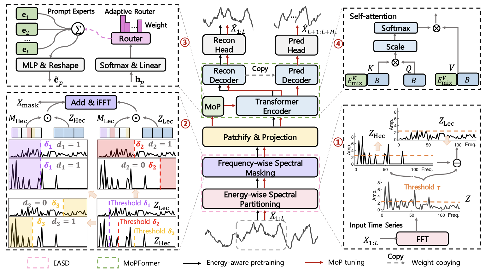

<div align="center">
  <h2><b>SEMPO: Lightweight Foundation Models for Time Series Forecasting </b></h2>
</div>

<div align="center">


[](https://opensource.org/licenses/Apache-2.0)

</div>

SEMPO is a novel time series foundation model with significantly reduced model size and pre-training scale, yet demonstrating superior generalization ability on diverse downstream forecasting tasks.

## Updates/News

* Oct 2025: Release of SEMPO library, along with SEMPO preprint now on [arXiv](https://arxiv.org/pdf/2409.16040).
  
* Sep 2025: The [SEMPO Paper](https://arxiv.org/abs/2402.02592) has been accepted to NeurIPS 2025 as a Poster presentation!

## Introduction

This work proposes SEMPO, a novel lightweight foundation model that requires pretraining on relatively small-scale data, yet exhibits strong general time series forecasting. SEMPO comprises two key modules: 1) energy-aware SpEctral decomposition module, that substantially improves the utilization of pre-training data by modeling not only the high-energy frequency signals but also the low-energy yet informative frequency signals that are ignored in current methods; and 2) Mixture-of-PrOmpts enabled Transformer, that learns heterogeneous temporal patterns through small dataset-specific prompts and adaptively route time series tokens to these prompt-based experts for parameter-efficient model adaptation across different datasets and domains. Equipped with these modules, SEMPO significantly reduces both pre-training data scale and model size, while achieving strong generalization. 


<p align="center">
    
</p>

## 📚 Pre-training Data

We use the [numpy format UTSD](https://cloud.tsinghua.edu.cn/f/93868e3a9fb144fe9719/) and [PEMS04/07](https://drive.google.com/drive/my-drive?dmr=1&ec=wgc-drive-hero-goto) as pretraining data. 

## ⚙️ Installation

Install Pytorch 2.1.2+cu118 with Python 3.10, and then install the dependencies:

```setup
pip install -r requirements.txt
```

## Pre-training

To pretrain the model(s) in the paper, run this command:

```pre-training
bash ./scripts/time_series_forecasting/pretrain/sempo_utsd.sh
```

>📋  This command supports both single-GPU and multi-GPU execution on a single node. For convenience, we provide a single-GPU pretrained model in the folder ./checkpoints/.

## Fine-tuning

To fine-tune the model(s) in the paper, run this command:

```fine-tuning
bash ./scripts/time_series_forecasting/few_shot/sempo_ETTh1.sh
```

>📋  1. Put downstream datasets under the folder ./dataset/. 2. Put the checkpoint under the folder ./checkpoints/. 3. Fine-tune the model. We provide the fine-tuning examples under the folder ./scripts/time_series_forecasting/Long_term. We set --is_pretraining 0, --is_training 1, and --is_zeroshot 0, with two configurations of 5% and 10%.

## Evaluation

To evaluate the model(s) in the paper, run this command:

```eval
bash ./scripts/time_series_forecasting/zero_shot/sempo_weather.sh
```

>📋  Following the 1 and 2 steps as the aforementioned fine-tuning process. 3. Evaluate the model. We provide the evaluation examples under the folder ./scripts/time_series_forecasting/Long_term. We set --is_pretraining 0, --is_training 0, and --is_zeroshot 1.


## Contributing

>📋  Pick a licence and describe how to contribute to your code repository.

## Citation

> 🙋 Please let us know if you find out a mistake or have any suggestions!

> 🌟 If you find the SEMPO model helpful in your research, please consider to star this repository and cite the
> corresponding [paper](https://arxiv.org/pdf/2409.16040):

```
@misc{
}
```


